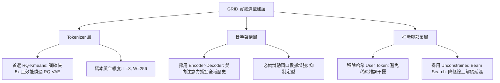

<meta>
Title: Generative Recommendation with Semantic IDs: Snap GRID 實踐手冊與實證消融全解析
Summary: 本文深度拆解 Snap Research 開源框架 GRID（Generative Recommendation with Semantic IDs）的核心實證發現。聚焦於 Tokenizer 選型（RQ-Kmeans vs RQ-VAE）、編碼器 Scaling 邊際效應、碼本長度與寬度權衡、Encoder-Decoder 架構優勢、User Token 與碰撞去重迷思，以及受限 Beam Search 的推斷效率取捨。
Slug: grid-generative-recommendation-handbook-zh-tw
Output: notes/grid-generative-recommendation-handbook/grid-generative-recommendation-handbook-zh-tw.html
CanonicalId: grid-generative-recommendation-handbook
Style: default
EstimatedReadingTime: true
Lang: zh-tw
Tags: recommendation systems, generative retrieval, semantic id, tokenizer, snap grid, deep learning
Status: drafting
Published: 2026-08-22
LastModified: 2026-08-22
</meta>

<draft>
- 核心摘要與問題意識
    - 開源生成式推薦框架 GRID (Snap Research, arXiv:2507.22224) 透過統一模組化基準測試，拆解了過去各文獻設定不一帶來的迷思，提供工業界落地 Semantic ID (SID) 的實務指南。
- Tokenizer 實證評測：演算法與維度選型
    - RQ-Kmeans 性能全盤打敗或平手 RQ-VAE，且訓練迭代次數少 5 倍、無需複雜的編碼器-量化器協同訓練與白化技巧。
    - 語意編碼器 (Flan-T5) 規模從 780M 擴展至 11B (14 倍參數) 僅帶來邊際性能提升。
    - 碼本維度並非越大越好：需要權衡可學習性與語意容量，實驗證實 $L=3, W=256$ 達最佳平衡。
- 生成架構與推斷優化：拆解 5 大工程迷思
    - 用戶 Token：在 SID 序列中加入哈希 User Token 無法提升個性化，移除反而達最佳性能。
    - 模型架構：Encoder-Decoder 顯著優於 Decoder-Only，前者的雙向注意力能捕捉更豐富的全域歷史序列模式。
    - 數據增強：滑動窗口子序列擴增對於提升泛化性與抑制定型至關重要。
    - 碰撞去重：Tiger 追加數字 Token 去重與隨機挑選性能相仿，但前者大幅增加序列長度與解碼複雜度。
    - 受限解碼：Trie 樹前綴受限 Beam Search 與不受限 Beam Search 推薦準確率相當，不受限解碼大幅降低計算開銷與延遲。
- 總結與關鍵結語
    - 工業落地應優先選用輕量強健的模組（RQ-Kmeans + Encoder-Decoder + 不受限解碼），而非盲目追求複雜組件。
</draft>

# Generative Recommendation with Semantic IDs: Snap GRID 實踐手冊與實證消融全解析

<callout>
**核心觀點 Summary**：Snap Research 開源的生成式推薦框架 **GRID**（*Generative Recommendation with Semantic IDs: A Practitioner’s Handbook*, arXiv:2507.22224）針對基於語意識別碼（Semantic ID, SID）的生成式檢索/推薦模型進行了系統性的組件消融與基准測試。研究揭示了多項顛覆直覺的工程實證：**RQ-Kmeans 的推薦效果顯著優於難以訓練的 RQ-VAE**；**Encoder-Decoder 架構顯著打敗 Decoder-Only**；而過去常用的 **User Token、碰撞後追加去重 Token、以及 Trie 樹受限 Beam Search 在實務中效益極低甚至有害**。
</callout>

在 <content-link canonical="semantic-id-in-generative-recommendation">生成式推薦的基石：Semantic ID 如何破解海量商品 Token 化難題</content-link> 中，我們探討了 Semantic ID (SID) 如何將傳統的獨立流水號 (Atomic ID) 因子化為具備階層語意的離散 Token 序列。然而，在過往的學術文獻中，各研究團隊採用的 Tokenizer 演算法、超參數、骨幹網路與實驗設定大相逕庭，導致工業界在評估生成式推薦落地時缺乏統一且客觀的選型依據。

為了填補這一空白，Snap Research 開源了 **GRID** (Generative Recommendation with Semantic IDs) 模組化框架與基準測試。本文將深入剖析 GRID 手冊中的核心實證，拆解在 Semantic ID Tokenizer、生成骨幹架構與推斷策略上的常見迷思。

---

## 1. Tokenizer 實證評測：演算法、規模與維度選型

Semantic ID 的品質決定了生成式推薦模型的上限。GRID 框架針對商品文本語意特徵（包含 Title、Category、Description、Price 等）進行文字 Embedding 提取，並比較不同 Tokenizer 變體的推薦表現。

### 1.1 RQ-Kmeans vs. RQ-VAE：極簡聚類為何擊敗複雜自編碼器？

在過去的研究中（如 TIGER 論文），**RQ-VAE**（Residual Quantized Variational Autoencoder）被視為生成 Semantic ID 的標準做法。然而，RQ-VAE 需要同時訓練連續空間的 Autoencoder 與離散量化 Codebook，極易遭遇**碼本崩塌 (Codebook Collapse)**，必須依賴複雜的數據白化 (Whitening) 或重化技巧。

GRID 的消融實驗帶來了令人意外的實證結果：

| Quantization 演算法 | 訓練迭代次數 (Steps) | 訓練複雜度 | 推薦效能 (NDCG@10 / Recall@10) |
| :--- | :--- | :--- | :--- |
| **RQ-VAE** | 15,000 steps | **高**（需 Autoencoder 協同訓練 + 白化防崩塌） | 較差 / 基準 |
| **R-VQ** | 1,000 steps/layer | **中**（對殘差歸一化） | 接近或優於 RQ-VAE |
| **RQ-Kmeans** | 1,000 steps/layer | **低**（階層式 K-Means 分群 + 殘差歸一化） | **最優 (SOTA)** |

<block>
**工程啟示**：**RQ-Kmeans 僅需 RQ-VAE 約 $\frac{1}{5}$ 的訓練迭代步數**，且完全不需維護 Autoencoder 網路，其生成的 Semantic ID 在最終生成式推薦任務上的表現卻超越了 RQ-VAE。這證明了對於語意向量的離散量化，純粹幾何殘差聚類已足夠優異，無需盲目引入複雜的自編碼器架構。
</block>

### 1.2 語意編碼器 Scaling Limit：大模型 Embedding 效益遞減

GRID 評估了不同參數量的文字語意提取器（使用 Flan-T5 家族提取商品文本最後一層隱藏狀態平均值）：
- **Flan-T5-Large** (780M 參數)
- **Flan-T5-XL** (3B 參數)
- **Flan-T5-XXL** (11B 參數)

實驗顯示，當語意編碼器的參數規模**擴大超過 14 倍**（780M $\rightarrow$ 11B）時，最終生成式推薦的 Recall@k 與 NDCG@k **僅帶來微乎其微的邊際提升**。

### 1.3 碼本維度權衡：深度 $L$ 與寬度 $W$ 的平衡點

Semantic ID 通常由長度 $L$（層數）與寬度 $W$（每層 Codebook 大小）組成，總候選碼空間為 $W^L$。GRID 對 $L$ 與 $W$ 進行了廣泛搜尋：

- **碼本寬度 $W$**：當 $W=256$ 時表現最佳。
- **碼本長度 $L$**：隨著 $L$ 增加（如從 3 層增加到 4 層或 5 層），SID 雖然能表達更細緻的語意容量，但**生成模型在後續 Token 上的預測準確率大幅崩跌**。

$$\text{Trade-off: } \text{Semantic Capacity } (L \uparrow) \quad \text{vs.} \quad \text{Autoregressive Learnability } (L \downarrow)$$

實驗結論指出，**$L=3, W=256$ 是目前的黃金組合**。過深的 Token 序列會使自迴歸模型在預測末端殘差 Token 時失準，反而破壞整體檢索效能。

---

## 2. 生成架構與推斷優化：拆解 5 大工程迷思

在確定 Tokenizer 方案後，GRID 進一步對生成式推薦模型的骨幹架構與推斷技巧進行了嚴謹的控制變因測試。

### 2.1 迷思一：User Token 能否帶來個性化？
* **做法**：TIGER 論文曾提出將用戶 ID 透過固定 Hash 映射至離散詞表，並將此 **User Token** 加在 SID 序列頭部，期望模型學習用戶個體偏好。
* **GRID 實證**：增大 User Token 詞表無助於提升推薦品質；**完全移除 User Token 反而能獲得最佳效能**。
* **原因分析**：用戶 Token 過於稀疏，且與商品 SID 的語意空間無關，添加 User Token 只會干擾注意力機制對歷史行為序列的聚焦。

### 2.2 迷思二：Decoder-Only 真的優於 Encoder-Decoder 嗎？
* **現狀**：受 LLM（如 LLaMA / GPT）影響，許多新型推薦模型（如 OneRec v2）傾向採用 Decoder-Only 架構以節省編碼器算力。
* **GRID 實證**：在相同的參數預算下，**Encoder-Decoder 架構的推薦表現顯著超越 Decoder-Only**。
* **原因分析**：Encoder-Decoder 的 Encoder 採用雙向注意力（Bidirectional Attention），能夠對用戶過去複雜的歷史行為序列進行全域 context 融會貫通；而 Decoder-Only 的因果遮罩（Causal Mask）限制了歷史行為之間的雙向資訊流。

### 2.3 迷思三：滑動窗口數據增強的強健性紅利
* **做法**：利用滑動窗口 (Sliding Window)，將單一用戶長序列切分為所有可能的相鄰子序列（如 $[i_1 \rightarrow i_2]$, $[i_1, i_2 \rightarrow i_3]$）。
* **GRID 實證**：**數據增強對於模型效能至關重要**。沒有數據增強的模型極易在小規模序列上記錄過擬合，而滑動窗口擴充大幅提升了模型對非完備歷史行為的泛化能力。

### 2.4 迷思四：SID 碰撞解法 (Deduplication) 值得長序列成本嗎？
當不同商品經量化後產生完全相同的 Semantic ID 時，稱為 **Collision（碰撞）**。
- **TIGER 去重法**：在碰撞的 SID 尾端追加一個遞增數字 Token（例如 `[c1, c2, c3, #1]` 與 `[c1, c2, c3, #2]`）。
- **隨機挑選法**：當模型生成碰撞 SID 時，在該 SID 對應的候選商品集中隨機挑選一個。

GRID 實驗發現，兩種方法在 NDCG@10 與 Recall@10 上**表現幾乎相同**。但 TIGER 方法增加了所有商品的 Token 序列長度，進一步拉高了 Beam Search 的解碼延遲。因此，**在碰撞率較低的場景下，無需為了極少數碰撞而引入額外的去重 Token**。

### 2.5 迷思五：Trie 樹受限解碼 (Constrained Search) 是必須的嗎？
* **受限解碼 (Constrained Beam Search)**：利用前綴樹（Trie Tree）在自迴歸解碼的每一步強行遮罩無效 Token，確保生成的 SID 必然存在於商品庫中。
* **不受限解碼 (Unconstrained Beam Search)**：允許模型自由生成任意 SID 序列，最後將無效 SID 直接過濾。

GRID 的比較結果如下：

| 解碼策略 | 推薦準確率 (NDCG / Recall) | 解碼吞吐量與計算開銷 |
| :--- | :--- | :--- |
| **Constrained Beam Search** | 基準 | 較慢（每步需查詢 Trie Tree 遮罩 Logits） |
| **Unconstrained Beam Search** | **相當 (Comparable)** | **顯著快速（原生 KV-Cache Beam Search）** |

<block>
**工程啟示**：當生成模型訓練充分時，模型自身學習到的轉移機率已能高度集中在有效的 SID 前綴上，「幻覺」產生無效 ID 的比例極低。因此，**在工業線上部署時，直接採用不受限的極速 Beam Search 即可兼顧精度與低延遲**。
</block>

---

## 3. 總結與實踐建議

Snap Research 的 GRID 框架透過客觀的消融實驗，為生成式推薦系統（Generative Recommendation with Semantic IDs）建立了一套極具實務價值的工程選型準則：

1. **Tokenizer**：優先選擇 **RQ-Kmeans**（$L=3, W=256$），放棄高維複雜且難訓的 RQ-VAE 與過度膨脹的 Flan-T5 模型。
2. **Architecture**：堅持使用 **Encoder-Decoder** 骨幹網路，並搭配**滑動窗口子序列增強**。
3. **Inference**：捨棄無效的 **User Token** 與複雜的 **Trie 樹受限解碼**，使用原生 **Unconstrained Beam Search** 達成最佳線上吞吐。

## 參考資料（References）

### 學術論文（Academic Literature）
1. **GRID (Snap Research)**: Zhang, Y., et al. (2025). Generative Recommendation with Semantic IDs: A Practitioner’s Handbook. *arXiv preprint arXiv:2507.22224*. [arXiv:2507.22224](https://arxiv.org/abs/2507.22224)
2. **TIGER**: Rajput, S., et al. (2022). Recommender Systems with Generative Retrieval. *Advances in Neural Information Processing Systems (NeurIPS 2022)*, 35, 10299-10313. [arXiv:2305.05065](https://arxiv.org/abs/2305.05065)
3. **RQ-VAE**: Zeghidour, N., et al. (2021). SoundStream: An End-to-End Neural Audio Codec. *IEEE/ACM Transactions on Audio, Speech, and Language Processing*, 30, 495-507. [arXiv:2107.03312](https://arxiv.org/abs/2107.03312)

### 技術文章（Technical Articles）
1. [知乎：Snap 开源生成式召回 Generative Recommendation with Semantic IDs: A Practitioner’s Handbook](https://zhuanlan.zhihu.com/p/1948788125842248769)

### 開源專案與代碼（Open Source Code）
1. **[Snap GRID Github](https://github.com/snap-research/GRID)**

<reviewkit>
<qprompt count=10 type=["mcq"]>
請根據本文關於 Snap GRID 實踐手冊與 Semantic ID 生成式推薦的內容，生成 10 道單選題（MCQ）。題目應覆蓋以下重點：
1. RQ-Kmeans 相較於 RQ-VAE 在 Tokenizer 訓練複雜度與推薦效能上的優勢。
2. 碼本深度 L 與寬度 W 的權衡機制，以及 L=3, W=256 為何是黃金組合。
3. 為何 Encoder-Decoder 架構在生成式推薦中顯著優於 Decoder-Only。
4. User Token 與 Trie 樹受限 Beam Search (Constrained Search) 在實務中的消融實驗結果。
</qprompt>

<takeaways>
- **RQ-Kmeans 優於 RQ-VAE**：RQ-Kmeans 訓練步數減少 5 倍，無需維護 Autoencoder 與複雜的白化技巧，推薦效能全面勝出。
- **碼本維度平衡**：Semantic ID 的碼本長度與寬度 $L=3, W=256$ 最佳；過深的 Token 序列 ($L \ge 4$) 會導致自迴歸模型失準。
- **Encoder-Decoder 架構勝出**：雙向注意力能全域捕捉用戶歷史行為，表現顯著優於因果遮罩受限的 Decoder-Only。
- **簡化工程推斷**：哈希 User Token 無法帶來個性化；不受限 Beam Search (Unconstrained) 準確率與 Trie 樹受限解碼相當，但解碼開銷與延遲大幅降低。
</takeaways>
</reviewkit>
